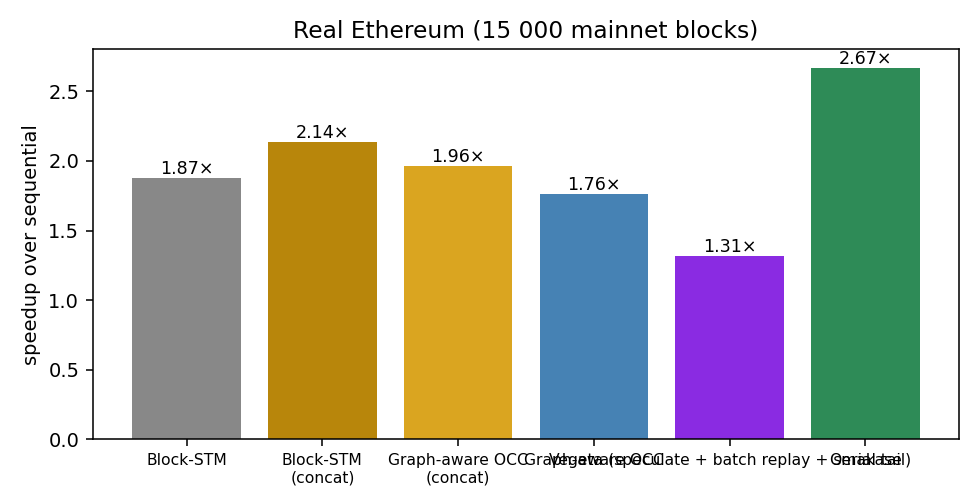
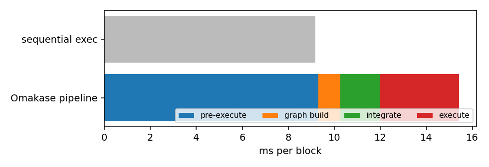
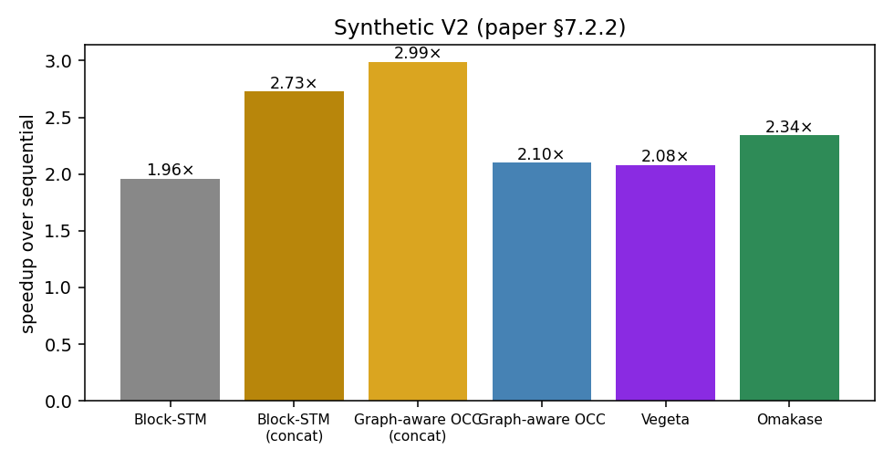
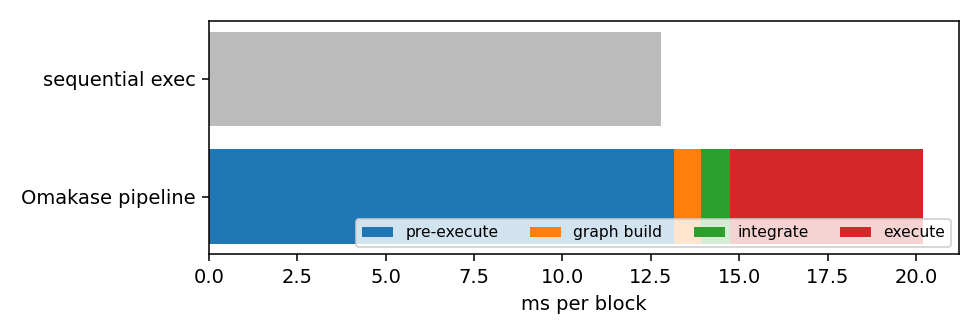
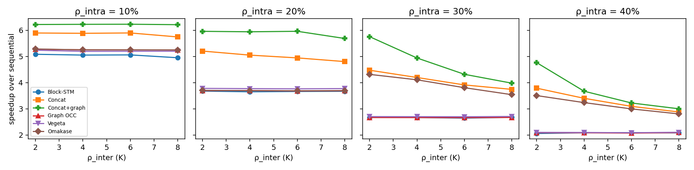

# Rebuttal experiments — generated tables

Machine: c4.8xlarge (18 cores / 36 threads, 58 GiB), t = 8 workers, τ_CV = 0.5, τ_hot = 1.5, InMemoryStorage.

## Real Ethereum (15 000 mainnet blocks)

**Absolute throughput and per-block latency** — 150 batches, 15,000 blocks, 2,387,073 txs

| Engine | total s | tx/s (aggregate) | ms/block p50 | p90 | p99 | speedup |
|---|---:|---:|---:|---:|---:|---:|
| Sequential | 137.7 | 17,335 | 8.82 | 12.45 | 15.11 | 1.00× |
| Block-STM | 73.5 | 32,494 | 4.57 | 7.13 | 10.75 | 1.87× |
| Block-STM, concatenated | 64.5 | 37,027 | 3.73 | 6.29 | 13.82 | 2.14× |
| Graph-aware OCC, concatenated | 70.2 | 33,983 | 4.10 | 6.73 | 14.63 | 1.96× |
| Graph-aware OCC | 78.2 | 30,536 | 4.96 | 7.28 | 10.77 | 1.76× |
| Vegeta (speculate + batch replay + serial tail) | 104.9 | 22,766 | 6.84 | 9.49 | 12.32 | 1.31× |
| Omakase | 51.6 | 46,253 | 3.36 | 4.15 | 5.94 | 2.67× |

**Where the time goes — full pipeline including the preparatory phases**

| Phase | total s | share | ms/block | cost as a fraction of sequential time |
|---|---:|---:|---:|---:|
| Pre-execute (proposer, once per block) | 139.6 | 60% | 9.31 | 1.01× |
| Build conflict graph + intra-block reorder | 14.1 | 6% | 0.94 | 0.10× |
| Integrate (greedy, per committed round) | 25.9 | 11% | 1.73 | 0.19× |
| Execute (Omakase, parallel) | 51.6 | 22% | 3.44 | 0.37× |
| **All phases on one node** | **231.2** | 100% | **15.42** | **1.68×** (speedup 0.60×) |
| Validator-side: integrate + execute | 77.5 |  | 5.17 | 0.56× (speedup 1.78×) |
| Sequential execution (reference) | 137.7 |  | 9.18 | 1.00× |

Vegeta's schedule construction (Rule-1 reorder + DAG rebuild) on the same pre-pass: 24.02 s total, 1.601 ms/block.

**Metadata shipped in a proposal**

| Payload | MB total | KB/block | vs calldata |
|---|---:|---:|---:|
| Transaction calldata (what a block already carries) | 1729.2 | 115.3 | 100% |
| Omakase per-block conflict graph (access-set hashes + WAW edges) | 211.3 | 14.1 | 12.2% |
| Vegeta schedule (same encoding) | 237.0 | 15.8 | 13.7% |

**Worst case across rounds (execution phase, in-memory)**

| Engine | mean speedup | worst round | p10 | rounds slower than sequential | p99/p50 latency |
|---|---:|---:|---:|---:|---:|
| Block-STM | 1.94× | 1.17× | 1.63× | 0 | 2.35 |
| Block-STM, concatenated | 2.35× | 0.75× | 1.81× | 8 | 3.71 |
| Omakase | 2.66× | 1.90× | 2.25× | 0 | 1.77 |

**Speedup by contention level** (rounds split by Block-STM's re-execution rate)

| rounds | Block-STM re-exec/tx | Block-STM | Concat | Omakase |
|---|---:|---:|---:|---:|
| low contention (bottom 20% Block-STM re-exec/tx) | 0.42 | 1.86× | 2.34× | 2.74× |
| high contention (top 20%) | 0.70 | 1.81× | 1.99× | 2.52× |

**Aborts and re-executions** — 2,387,073 txs (diagnostics build)

| Engine | re-executions / tx | validation aborts / tx | cascade aborts / tx | re-exec writing a new location / tx | cascade share of aborts |
|---|---:|---:|---:|---:|---:|
| Block-STM | 0.548 | 0.182 | 0.0291 | 0.0073 | 16% |
| Block-STM, concatenated | 0.830 | 0.195 | 0.0048 | 0.0075 | 2% |
| Graph OCC, concatenated | 0.649 | 0.360 | 0.0095 | 0.0027 | 3% |
| Graph-aware OCC | 0.346 | 0.154 | 0.0148 | 0.0004 | 10% |
| Vegeta | 0.339 | 0.195 | 0.0283 | 0.0006 | 15% |
| Omakase | 0.419 | 0.206 | 0.0069 | 0.0009 | 3% |

*cascade abort* = validation failure because a lower-indexed writer appeared after the read; *re-exec writing a new location* = a re-execution whose write set differs from its previous *recorded* incarnation (post-blocking first executions excluded). On real Ethereum this is ~0 for every engine: cascades propagate through values, not access sets.

 

## Synthetic V2 (paper §7.2.2)

**Absolute throughput and per-block latency** — 150 batches, 15,000 blocks, 2,387,073 txs

| Engine | total s | tx/s (aggregate) | ms/block p50 | p90 | p99 | speedup |
|---|---:|---:|---:|---:|---:|---:|
| Sequential | 191.6 | 12,457 | 12.16 | 15.80 | 21.95 | 1.00× |
| Block-STM | 97.9 | 24,371 | 6.04 | 8.11 | 17.01 | 1.96× |
| Block-STM, concatenated | 70.3 | 33,962 | 4.43 | 5.45 | 13.24 | 2.73× |
| Graph-aware OCC, concatenated | 64.1 | 37,217 | 4.04 | 4.94 | 12.62 | 2.99× |
| Graph-aware OCC | 91.3 | 26,143 | 5.63 | 7.67 | 16.30 | 2.10× |
| Vegeta (speculate + batch replay + serial tail) | 144.2 | 16,558 | 9.13 | 11.63 | 20.04 | 1.33× |
| Omakase | 81.9 | 29,163 | 5.09 | 6.42 | 14.99 | 2.34× |

**Where the time goes — full pipeline including the preparatory phases**

| Phase | total s | share | ms/block | cost as a fraction of sequential time |
|---|---:|---:|---:|---:|
| Pre-execute (proposer, once per block) | 197.4 | 65% | 13.16 | 1.03× |
| Build conflict graph + intra-block reorder | 11.5 | 4% | 0.77 | 0.06× |
| Integrate (greedy, per committed round) | 12.4 | 4% | 0.83 | 0.06× |
| Execute (Omakase, parallel) | 81.9 | 27% | 5.46 | 0.43× |
| **All phases on one node** | **303.1** | 100% | **20.21** | **1.58×** (speedup 0.63×) |
| Validator-side: integrate + execute | 94.3 |  | 6.28 | 0.49× (speedup 2.03×) |
| Sequential execution (reference) | 191.6 |  | 12.77 | 1.00× |

Vegeta's schedule construction (Rule-1 reorder + DAG rebuild) on the same pre-pass: 31.88 s total, 2.125 ms/block.

**Metadata shipped in a proposal**

| Payload | MB total | KB/block | vs calldata |
|---|---:|---:|---:|
| Transaction calldata (what a block already carries) | 1587.0 | 105.8 | 100% |
| Omakase per-block conflict graph (access-set hashes + WAW edges) | 192.2 | 12.8 | 12.1% |
| Vegeta schedule (same encoding) | 231.6 | 15.4 | 14.6% |

**Worst case across rounds (execution phase, in-memory)**

| Engine | mean speedup | worst round | p10 | rounds slower than sequential | p99/p50 latency |
|---|---:|---:|---:|---:|---:|
| Block-STM | 2.04× | 1.24× | 1.72× | 0 | 2.82 |
| Block-STM, concatenated | 2.85× | 1.59× | 2.25× | 0 | 2.99 |
| Omakase | 2.43× | 1.43× | 2.05× | 0 | 2.94 |

**Speedup by contention level** (rounds split by Block-STM's re-execution rate)

| rounds | Block-STM re-exec/tx | Block-STM | Concat | Omakase |
|---|---:|---:|---:|---:|
| low contention (bottom 20% Block-STM re-exec/tx) | 0.53 | 2.26× | 3.34× | 2.69× |
| high contention (top 20%) | 0.93 | 1.75× | 2.27× | 2.02× |

**Aborts and re-executions** — 2,387,073 txs (diagnostics build)

| Engine | re-executions / tx | validation aborts / tx | cascade aborts / tx | re-exec writing a new location / tx | cascade share of aborts |
|---|---:|---:|---:|---:|---:|
| Block-STM | 0.731 | 0.214 | 0.0418 | 0.0000 | 20% |
| Block-STM, concatenated | 1.179 | 0.217 | 0.0045 | 0.0000 | 2% |
| Graph OCC, concatenated | 0.000 | 0.000 | 0.0000 | 0.0000 | 0% |
| Graph-aware OCC | 0.000 | 0.000 | 0.0000 | 0.0000 | 0% |
| Vegeta | 0.000 | 0.000 | 0.0000 | 0.0000 | 0% |
| Omakase | 0.000 | 0.000 | 0.0000 | 0.0000 | 0% |

*cascade abort* = validation failure because a lower-indexed writer appeared after the read; *re-exec writing a new location* = a re-execution whose write set differs from its previous *recorded* incarnation (post-blocking first executions excluded). On real Ethereum this is ~0 for every engine: cascades propagate through values, not access sets.

 

## Artificial workload (tunable conflict)

**Artificial workload — speedup over sequential (t=8, H=5)**

| ρ_inter K | ρ_intra M | Block-STM | Concat | Concat+graph | Graph OCC | Vegeta | Omakase |
|---|---:|---:|---:|---:|---:|---:|---:|
| 2 | 10% | 5.08 | 5.89 | 6.22 | 5.27 | 5.24 | 5.28 |
| 4 | 10% | 5.05 | 5.88 | 6.22 | 5.25 | 5.19 | 5.25 |
| 6 | 10% | 5.06 | 5.89 | 6.23 | 5.25 | 5.20 | 5.25 |
| 8 | 10% | 4.95 | 5.74 | 6.21 | 5.24 | 5.20 | 5.25 |
| 2 | 20% | 3.67 | 5.20 | 5.96 | 3.69 | 3.78 | 3.70 |
| 4 | 20% | 3.65 | 5.05 | 5.94 | 3.69 | 3.77 | 3.69 |
| 6 | 20% | 3.66 | 4.94 | 5.96 | 3.68 | 3.76 | 3.69 |
| 8 | 20% | 3.67 | 4.80 | 5.68 | 3.69 | 3.77 | 3.69 |
| 2 | 30% | 2.67 | 4.47 | 5.75 | 2.67 | 2.70 | 4.31 |
| 4 | 30% | 2.67 | 4.19 | 4.94 | 2.66 | 2.70 | 4.11 |
| 6 | 30% | 2.64 | 3.91 | 4.32 | 2.66 | 2.70 | 3.80 |
| 8 | 30% | 2.67 | 3.74 | 3.98 | 2.67 | 2.71 | 3.54 |
| 2 | 40% | 2.06 | 3.79 | 4.76 | 2.09 | 2.10 | 3.50 |
| 4 | 40% | 2.08 | 3.40 | 3.67 | 2.08 | 2.09 | 3.24 |
| 6 | 40% | 2.09 | 3.09 | 3.22 | 2.07 | 2.08 | 2.99 |
| 8 | 40% | 2.08 | 2.88 | 3.00 | 2.09 | 2.10 | 2.80 |

**Artificial workload — re-executions per transaction**

| K | M | Block-STM | Concat | Concat+graph | Graph OCC | Vegeta | Omakase |
|---|---:|---:|---:|---:|---:|---:|---:|
| 2 | 10% | 0.100 | 0.101 | 0.000 | 0.000 | 0.000 | 0.000 |
| 4 | 10% | 0.101 | 0.106 | 0.000 | 0.000 | 0.000 | 0.000 |
| 6 | 10% | 0.100 | 0.109 | 0.000 | 0.000 | 0.000 | 0.000 |
| 8 | 10% | 0.100 | 0.110 | 0.000 | 0.000 | 0.000 | 0.000 |
| 2 | 20% | 0.453 | 0.471 | 0.000 | 0.000 | 0.000 | 0.000 |
| 4 | 20% | 0.452 | 0.594 | 0.000 | 0.000 | 0.000 | 0.000 |
| 6 | 20% | 0.453 | 0.710 | 0.000 | 0.000 | 0.000 | 0.000 |
| 8 | 20% | 0.452 | 0.794 | 0.000 | 0.000 | 0.000 | 0.000 |
| 2 | 30% | 0.943 | 1.056 | 0.000 | 0.000 | 0.000 | 0.000 |
| 4 | 30% | 0.944 | 1.320 | 0.000 | 0.000 | 0.000 | 0.000 |
| 6 | 30% | 0.944 | 1.552 | 0.000 | 0.000 | 0.000 | 0.000 |
| 8 | 30% | 0.941 | 1.710 | 0.000 | 0.000 | 0.000 | 0.000 |
| 2 | 40% | 1.536 | 1.840 | 0.000 | 0.000 | 0.000 | 0.000 |
| 4 | 40% | 1.536 | 2.257 | 0.000 | 0.000 | 0.000 | 0.000 |
| 6 | 40% | 1.527 | 2.625 | 0.000 | 0.000 | 0.000 | 0.000 |
| 8 | 40% | 1.530 | 2.852 | 0.000 | 0.000 | 0.000 | 0.000 |

## Thread-count sweep — artificial

| worker threads | Block-STM | Concat | Concat+graph | Graph OCC | Vegeta | Omakase | groups/batch | re-exec/tx: Concat | Omakase |
|---|---:|---:|---:|---:|---:|---:|---:|---:|---:|
| 4 | 2.02 | 2.33 | 3.25 | 2.09 | 2.12 | 2.10 | 50.0 | 1.572 | 0.000 |
| 8 | 2.08 | 3.42 | 3.73 | 2.09 | 2.11 | 3.24 | 25.1 | 2.245 | 0.000 |
| 16 | 1.28 | 2.52 | 3.29 | 1.90 | 1.95 | 3.11 | 14.3 | 3.486 | 0.000 |
| 24 | 1.21 | 2.38 | 3.27 | 1.74 | 1.83 | 2.91 | 14.5 | 3.553 | 0.000 |
| 32 | 1.23 | 2.39 | 3.27 | 1.58 | 1.80 | 2.77 | 14.5 | 3.413 | 0.000 |

## Thread-count sweep — real

| worker threads | Block-STM | Concat | Concat+graph | Graph OCC | Vegeta | Omakase | groups/batch | re-exec/tx: Concat | Omakase |
|---|---:|---:|---:|---:|---:|---:|---:|---:|---:|
| 4 | 1.78 | 2.12 | 2.01 | 1.79 | 1.66 | 2.44 | 41.4 | 0.322 | 0.269 |
| 8 | 1.96 | 2.37 | 2.14 | 1.84 | 1.75 | 2.68 | 21.1 | 0.864 | 0.420 |
| 16 | 1.32 | 1.85 | 1.93 | 1.71 | 1.66 | 2.39 | 35.6 | 1.261 | 0.401 |
| 24 | 1.24 | 1.80 | 1.98 | 1.65 | 1.61 | 2.23 | 58.5 | 1.426 | 0.323 |
| 32 | 1.22 | 1.59 | 1.97 | 1.56 | 1.53 | 2.07 | 73.5 | 1.507 | 0.262 |

## Round-size sweep — artificial

| blocks per round | Block-STM | Concat | Concat+graph | Graph OCC | Vegeta | Omakase | groups/batch | re-exec/tx: Concat | Omakase |
|---|---:|---:|---:|---:|---:|---:|---:|---:|---:|
| 5 | 2.08 | 2.51 | 2.59 | 2.10 | 2.13 | 2.50 | 3.8 | 2.542 | 0.000 |
| 10 | 2.11 | 3.17 | 3.38 | 2.09 | 2.12 | 3.00 | 5.9 | 2.250 | 0.000 |
| 20 | 2.08 | 3.14 | 3.37 | 2.09 | 2.12 | 3.01 | 11.5 | 2.332 | 0.000 |
| 50 | 2.08 | 3.42 | 3.73 | 2.09 | 2.10 | 3.23 | 25.1 | 2.252 | 0.000 |
| 100 | 2.05 | 3.34 | 3.68 | 2.08 | 2.09 | 3.29 | 48.8 | 2.280 | 0.000 |

## Round-size sweep — real

| blocks per round | Block-STM | Concat | Concat+graph | Graph OCC | Vegeta | Omakase | groups/batch | re-exec/tx: Concat | Omakase |
|---|---:|---:|---:|---:|---:|---:|---:|---:|---:|
| 5 | 1.89 | 2.36 | 2.14 | 1.81 | 1.71 | 2.18 | 2.4 | 0.916 | 0.418 |
| 10 | 1.89 | 2.47 | 2.23 | 1.80 | 1.71 | 2.28 | 3.7 | 0.963 | 0.420 |
| 20 | 1.91 | 2.54 | 2.26 | 1.81 | 1.72 | 2.38 | 5.4 | 0.962 | 0.426 |
| 50 | 1.94 | 2.43 | 2.12 | 1.83 | 1.73 | 2.59 | 10.6 | 0.916 | 0.426 |
| 100 | 1.95 | 2.37 | 2.13 | 1.83 | 1.74 | 2.68 | 21.1 | 0.867 | 0.419 |

## Merge-cap sweep (Omakase only varies) — artificial

| merge cap (blocks/group) | Block-STM | Concat | Concat+graph | Graph OCC | Vegeta | Omakase | groups/batch | re-exec/tx: Concat | Omakase |
|---|---:|---:|---:|---:|---:|---:|---:|---:|---:|
| 10 | 2.08 | 3.43 | 3.73 | 2.09 | 2.11 | 3.24 | 25.1 | 2.247 | 0.000 |
| 25 | 2.06 | 3.40 | 3.73 | 2.09 | 2.10 | 3.24 | 25.1 | 2.257 | 0.000 |
| 50 | 2.07 | 3.41 | 3.73 | 2.09 | 2.10 | 3.24 | 25.1 | 2.255 | 0.000 |
| 1000 | 2.08 | 3.41 | 3.74 | 2.09 | 2.10 | 3.24 | 25.1 | 2.267 | 0.000 |

## Merge-cap sweep (Omakase only varies) — real

| merge cap (blocks/group) | Block-STM | Concat | Concat+graph | Graph OCC | Vegeta | Omakase | groups/batch | re-exec/tx: Concat | Omakase |
|---|---:|---:|---:|---:|---:|---:|---:|---:|---:|
| 10 | 1.96 | 2.37 | 2.14 | 1.85 | 1.75 | 2.69 | 21.1 | 0.859 | 0.419 |
| 25 | 1.95 | 2.35 | 2.14 | 1.84 | 1.74 | 2.67 | 20.9 | 0.869 | 0.417 |
| 50 | 1.95 | 2.36 | 2.14 | 1.84 | 1.75 | 2.67 | 20.9 | 0.863 | 0.413 |
| 1000 | 1.96 | 2.36 | 2.04 | 1.84 | 1.75 | 2.68 | 20.9 | 0.866 | 0.414 |

## Aggressive integration (merge unless hot-key conflict) — artificial

| merge cap, tau_cv=0.01 | Block-STM | Concat | Concat+graph | Graph OCC | Vegeta | Omakase | groups/batch | re-exec/tx: Concat | Omakase |
|---|---:|---:|---:|---:|---:|---:|---:|---:|---:|
| 10 | 2.09 | 3.44 | 3.73 | 2.09 | 2.11 | 3.45 | 13.3 | 2.263 | 0.000 |
| 50 | 2.07 | 3.40 | 3.73 | 2.08 | 2.10 | 3.49 | 4.8 | 2.265 | 0.000 |
| 1000 | 2.05 | 3.40 | 3.75 | 2.08 | 2.10 | 3.49 | 4.8 | 2.267 | 0.000 |

## Aggressive integration (merge unless hot-key conflict) — real

| merge cap, tau_cv=0.01 | Block-STM | Concat | Concat+graph | Graph OCC | Vegeta | Omakase | groups/batch | re-exec/tx: Concat | Omakase |
|---|---:|---:|---:|---:|---:|---:|---:|---:|---:|
| 10 | 1.95 | 2.36 | 2.14 | 1.84 | 1.75 | 2.73 | 13.2 | 0.865 | 0.413 |
| 50 | 1.94 | 2.35 | 2.12 | 1.83 | 1.74 | 2.36 | 6.7 | 0.868 | 0.367 |
| 1000 | 1.96 | 2.37 | 2.15 | 1.84 | 1.75 | 1.68 | 4.8 | 0.865 | 0.250 |

## Per-transaction cost sweep — artificial

| simulated work per tx (TARGET) | Block-STM | Concat | Concat+graph | Graph OCC | Vegeta | Omakase | groups/batch | re-exec/tx: Concat | Omakase |
|---|---:|---:|---:|---:|---:|---:|---:|---:|---:|
| 100 | 2.08 | 3.41 | 3.74 | 2.09 | 2.10 | 3.26 | 25.0 | 2.255 | 0.000 |
| 500 | 2.35 | 4.08 | 4.27 | 2.38 | 2.39 | 3.82 | 25.2 | 3.462 | 0.000 |
| 2000 | 2.41 | 4.25 | 4.40 | 2.46 | 2.45 | 3.92 | 25.3 | 4.160 | 0.000 |

## Pipelined integration — real

| blocks/round | rounds | txs | seq s | Block-STM s | Omakase serial s | integration s | Omakase pipelined s | integration hidden |
|---|---:|---:|---:|---:|---:|---:|---:|---:|
| 100 | 10 | 170746 | 9.87 | 4.96 (1.99×) | 6.24 (1.58×) | 2.04 | 4.45 (2.22×) | 88% |
| 20 | 20 | 70070 | 3.94 | 2.05 (1.93×) | 2.88 (1.37×) | 0.82 | 2.14 (1.84×) | 90% |

## Emulated state-access latency — real Ethereum (20 Cancun batches, t=8)

| read latency µs | seq ms/block | Block-STM × | Concat × | Omakase exec × | Omakase exec+integrate × | integrate ms/block | integrate share of validator time | exec saved vs Block-STM ms/block | re-exec/tx Block-STM | Omakase |
|---|---:|---:|---:|---:|---:|---:|---:|---:|---:|---:|
| 0 | 10.6 | 1.95 | 2.37 | 2.74 | 1.86 | 1.85 | 32% | 1.57 | 0.62 | 0.42 |
| 1 | 12.4 | 2.05 | 2.50 | 2.78 | 1.95 | 1.90 | 30% | 1.58 | 0.61 | 0.42 |
| 2 | 13.8 | 2.10 | 2.58 | 2.78 | 2.03 | 1.84 | 27% | 1.61 | 0.61 | 0.41 |
| 5 | 18.5 | 2.25 | 2.76 | 2.83 | 2.20 | 1.89 | 22% | 1.69 | 0.60 | 0.40 |
| 10 | 26.0 | 2.35 | 2.86 | 2.82 | 2.35 | 1.85 | 17% | 1.86 | 0.59 | 0.40 |
| 20 | 41.1 | 2.43 | 2.93 | 2.81 | 2.49 | 1.88 | 11% | 2.33 | 0.58 | 0.41 |
| 50 | 85.5 | 2.43 | 2.96 | 2.74 | 2.59 | 1.83 | 6% | 3.90 | 0.57 | 0.43 |

Every account/slot read pays the latency in every engine; graph construction and integration never touch state and stay constant.

**Read latency × worker count** (real Ethereum, 20 batches; speedup over sequential at the same latency)

| read latency µs | workers | Block-STM | Concat | Omakase exec | Omakase exec+integ |
|---|---:|---:|---:|---:|---:|
| 20 | 8 | 2.43 | 2.93 | 2.81 | 2.49 |
| 20 | 16 | 2.19 | 2.83 | 2.69 | 2.37 |
| 20 | 32 | 2.08 | 2.58 | 2.51 | 2.30 |
| 50 | 8 | 2.43 | 2.96 | 2.74 | 2.59 |
| 50 | 16 | 2.39 | 2.96 | 2.72 | 2.55 |
| 50 | 32 | 2.28 | 2.87 | 2.54 | 2.43 |

## Live 4-validator Mysticeti deployment — minround1 (ERC20 8x4x8, steady state, per validator)

| execution mode | load step | committed tx/s | executor busy | implied executor capacity tx/s | blocks/round | rounds |
|---|---:|---:|---:|---:|---:|---:|
| sequential | 0 | 39,949 | 42% | 94,610 | 1.3 | 20,390 |
| parallel | 0 | 39,986 | 46% | 86,878 | 1.3 | 21,160 |
| concatenated | 0 | 39,961 | 43% | 92,289 | 1.2 | 22,710 |
| integrated | 0 | 39,943 | 84% | 47,551 | 3.9 | 3,957 |
| sequential | 1 | 39,907 | 42% | 94,399 | 1.2 | 21,898 |
| parallel | 1 | 39,962 | 47% | 84,980 | 1.2 | 22,847 |
| concatenated | 1 | 39,931 | 44% | 90,907 | 1.2 | 22,678 |
| integrated | 1 | 39,913 | 84% | 47,291 | 4.0 | 3,554 |

The generator caps committed throughput at ~40k tx/s per validator in every mode, so the executor is never the bottleneck here; *executor busy* is the share of wall-clock the executor spends on its round (all stages, pre-execution and integration included for Omakase), and *implied capacity* = tx/s ÷ busy. Load step 0/1 = successive PEVM_LOAD settings.

## Live 4-validator Mysticeti deployment — minround1000 (ERC20 8x4x8, steady state, per validator)

| execution mode | load step | committed tx/s | executor busy | implied executor capacity tx/s | blocks/round | rounds |
|---|---:|---:|---:|---:|---:|---:|
| sequential | 0 | 39,405 | 39% | 100,780 | 9.8 | 2,638 |
| parallel | 0 | 39,968 | 44% | 90,069 | 9.8 | 2,681 |
| concatenated | 0 | 40,012 | 32% | 123,685 | 9.8 | 2,738 |
| integrated | 0 | 39,970 | 80% | 50,245 | 5.3 | 1,930 |

The generator caps committed throughput at ~40k tx/s per validator in every mode, so the executor is never the bottleneck here; *executor busy* is the share of wall-clock the executor spends on its round (all stages, pre-execution and integration included for Omakase), and *implied capacity* = tx/s ÷ busy. Load step 0/1 = successive PEVM_LOAD settings.
