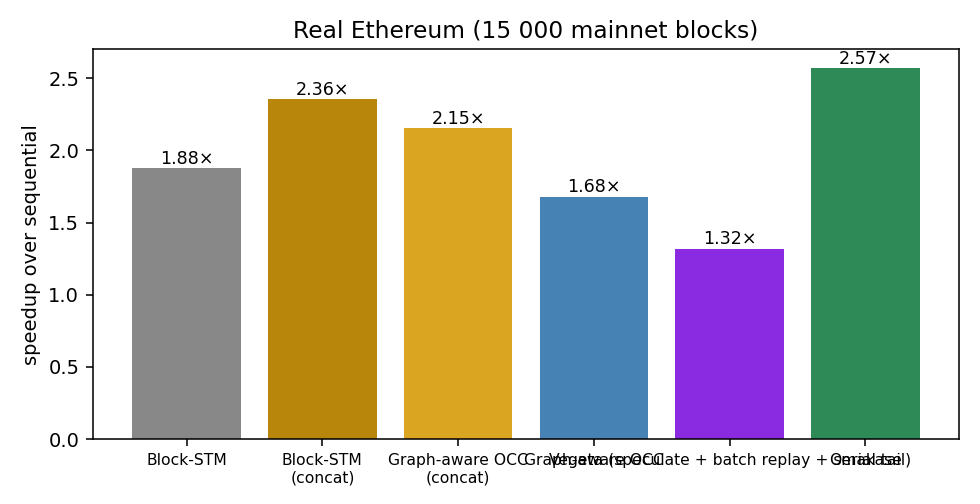
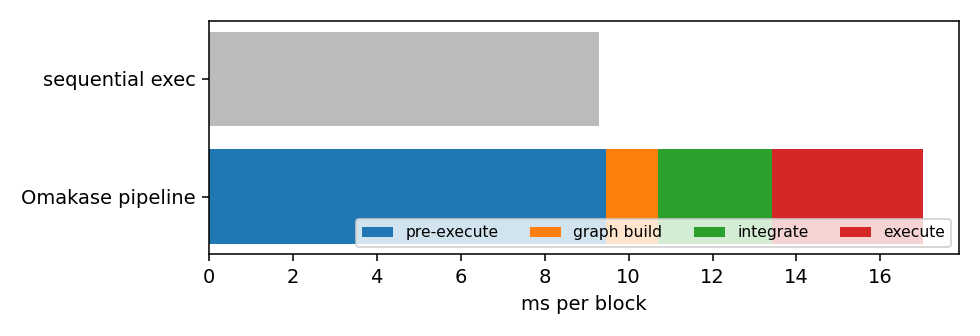
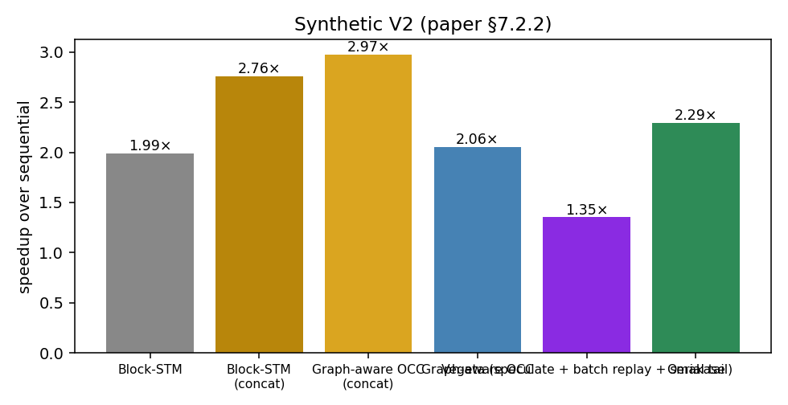
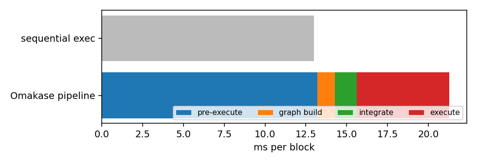
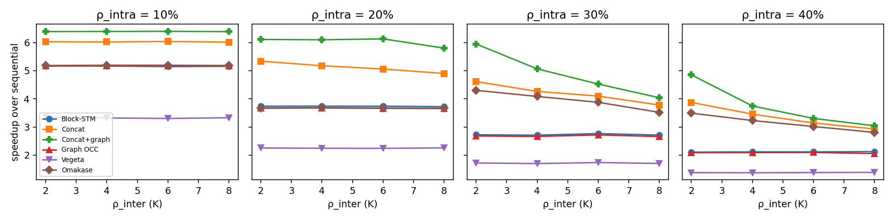

# Rebuttal experiments — generated tables

Machine: c4.8xlarge (18 cores / 36 threads, 58 GiB), t = 8 workers, τ_CV = 0.5, τ_hot = 1.5, InMemoryStorage.

Rounds in which any engine fell back to sequential execution of an optimistic window are excluded from every table (see the note at the end for the count per file).

## Real Ethereum (15 000 mainnet blocks)

**Absolute throughput and per-block latency** — 131 batches, 13,100 blocks, 2,086,013 txs

| Engine | total s | tx/s (aggregate) | ms/block p50 | p90 | p99 | speedup |
|---|---:|---:|---:|---:|---:|---:|
| Sequential | 121.7 | 17,137 | 8.73 | 12.92 | 15.22 | 1.00× |
| Block-STM | 64.9 | 32,147 | 4.58 | 7.27 | 10.85 | 1.88× |
| Block-STM, concatenated | 51.7 | 40,371 | 3.68 | 5.43 | 9.52 | 2.36× |
| Graph-aware OCC, concatenated | 56.5 | 36,910 | 3.99 | 5.61 | 9.81 | 2.15× |
| Graph-aware OCC | 72.5 | 28,775 | 5.26 | 7.58 | 11.48 | 1.68× |
| Vegeta (speculate + batch replay + serial tail) | 92.3 | 22,599 | 6.84 | 9.70 | 12.33 | 1.32× |
| Omakase | 47.3 | 44,057 | 3.53 | 4.23 | 6.05 | 2.57× |

**Where the time goes — full pipeline including the preparatory phases**

| Phase | total s | share | ms/block | cost as a fraction of sequential time |
|---|---:|---:|---:|---:|
| Pre-execute (proposer, once per block) | 123.9 | 56% | 9.46 | 1.02× |
| Build conflict graph + intra-block reorder | 16.2 | 7% | 1.23 | 0.13× |
| Integrate (greedy, per committed round) | 35.5 | 16% | 2.71 | 0.29× |
| Execute (Omakase, parallel) | 47.3 | 21% | 3.61 | 0.39× |
| All phases on one node (single proposer, P = 1) | 223.0 | 100% | 17.02 | 1.83× (speedup 0.55×) |
| Validator-side: integrate + execute | 82.9 |  | 6.33 | 0.68× (speedup 1.47×) |
| **Every stage on one node, 1/P of proposer stages, P = 20** | **89.9** |  | **6.86** | **0.74×** (speedup 1.35×) |
| **Every stage on one node, 1/P of proposer stages, P = 50** | **85.7** |  | **6.54** | **0.70×** (speedup 1.42×) |
| **Every stage on one node, 1/P of proposer stages, P = 100** | **84.3** |  | **6.43** | **0.69×** (speedup 1.44×) |
| Sequential execution (reference) | 121.7 |  | 9.29 | 1.00× |

Vegeta's schedule construction (Rule-1 reorder + DAG rebuild) on the same pre-pass: 20.94 s total, 1.599 ms/block.

**Every stage on one node with P proposers** — round size = P (one block per proposer per round); ms/block

| P | blocks | seq. | proposer stages (pre-exec + graph) | integrate | execute | validator + proposer/P | exec only | integ + exec | every stage on one node, 1/P | Block-STM |
|---|---:|---:|---:|---:|---:|---:|---:|---:|---:|---:|
| 5 | 14,945 | 9.17 | 10.53 | 1.97 | 4.58 | 8.65 | 2.00× | 1.40× | **1.06×** | 1.82× |
| 10 | 14,600 | 9.18 | 10.59 | 2.24 | 4.29 | 7.59 | 2.14× | 1.41× | **1.21×** | 1.83× |
| 20 | 14,360 | 9.16 | 10.60 | 2.43 | 3.97 | 6.93 | 2.31× | 1.43× | **1.32×** | 1.85× |
| 50 | 14,100 | 9.09 | 10.46 | 2.59 | 3.72 | 6.52 | 2.44× | 1.44× | **1.39×** | 1.87× |
| 100 | 13,100 | 9.29 | 10.69 | 2.71 | 3.61 | 6.43 | 2.57× | 1.47× | **1.44×** | 1.88× |

Integration cost per block grows with the round (more candidate merges) while execution improves (more inter-block parallelism); the proposer stages are paid once per block by its proposer, so a validator pays 1/P of them. Round size 100 is the main campaign; the other sizes are the full-dataset round-size runs (`run_roundsize_full.sh`).

**Metadata shipped in a proposal**

| Payload | MB total | KB/block | vs calldata |
|---|---:|---:|---:|
| Transaction calldata (what a block already carries) | 1503.6 | 114.8 | 100% |
| Omakase per-block conflict graph (access-set hashes + WAW edges) | 241.5 | 18.4 | 16.1% |
| Vegeta schedule (same encoding) | 207.7 | 15.9 | 13.8% |

**Worst case across rounds (execution phase, in-memory)**

| Engine | mean speedup | worst round | p10 | rounds slower than sequential | p90/p50 per-block time |
|---|---:|---:|---:|---:|---:|
| Block-STM | 1.95× | 1.18× | 1.63× | 0 | 1.59 |
| Block-STM, concatenated | 2.45× | 1.25× | 1.89× | 0 | 1.48 |
| Omakase | 2.56× | 1.83× | 2.18× | 0 | 1.20 |

**Speedup by contention level** (rounds split by Block-STM's re-execution rate)

| rounds | Block-STM re-exec/tx | Block-STM | Concat | Omakase |
|---|---:|---:|---:|---:|
| low contention (bottom 20% Block-STM re-exec/tx) | 0.42 | 1.86× | 2.33× | 2.63× |
| high contention (top 20%) | 0.70 | 1.80× | 2.20× | 2.36× |

**Concatenated round: whole-window sequential fallback** — 0 of 131 rounds (concat re-executions = 0 in the diagnostics run; confirmed with `PEVM_TRACE_FALLBACK=1`: a transaction reads an account self-destructed earlier in the same optimistic window, pevm abandons the window and re-executes all of it sequentially). Per-block Block-STM and Omakase's <=10-block groups never fell back on these rounds because the self-destruct and the read land in different windows.

| chunk | round | txs | seq ms/block | Block-STM | Block-STM, concatenated | Graph OCC, concatenated | Graph-aware OCC | Omakase |
|---|---:|---:|---:|---:|---:|---:|---:|---:|

**Per-round statistics with and without the fallback rounds** (execution phase, speedup over sequential)

| rounds | engine | mean | worst | p10 | rounds < 1× | p90/p50 |
|---|---:|---:|---:|---:|---:|---:|
| all rounds | Block-STM | 1.95× | 1.18× | 1.63× | 0 | 1.59 |
| all rounds | Block-STM, concatenated | 2.45× | 1.25× | 1.89× | 0 | 1.48 |
| all rounds | Graph OCC, concatenated | 2.19× | 1.30× | 1.90× | 0 | 1.41 |
| all rounds | Graph-aware OCC | 1.71× | 1.15× | 1.50× | 0 | 1.44 |
| all rounds | Omakase | 2.56× | 1.83× | 2.18× | 0 | 1.20 |
| excluding fallback rounds | Block-STM | 1.95× | 1.18× | 1.63× | 0 | 1.59 |
| excluding fallback rounds | Block-STM, concatenated | 2.45× | 1.25× | 1.89× | 0 | 1.48 |
| excluding fallback rounds | Graph OCC, concatenated | 2.19× | 1.30× | 1.90× | 0 | 1.41 |
| excluding fallback rounds | Graph-aware OCC | 1.71× | 1.15× | 1.50× | 0 | 1.44 |
| excluding fallback rounds | Omakase | 2.56× | 1.83× | 2.18× | 0 | 1.20 |

**Worst genuine (non-fallback) rounds for the concatenated round**, with every engine's speedup and re-executions per tx

| chunk | round | txs | seq ms/block | Block-STM | Block-STM, concatenated | Graph OCC, concatenated | Graph-aware OCC | Omakase | re-exec/tx concat | Block-STM | Omakase |
|---|---:|---:|---:|---:|---:|---:|---:|---:|---:|---:|---:|
| real_18581726.csv | 39 | 16,163 | 24.46 | 1.18× | 1.25× | 1.30× | 1.15× | 4.10× | 0.81 | 0.45 | 0.33 |
| real_18581726.csv | 11 | 14,306 | 14.47 | 1.37× | 1.51× | 1.43× | 1.29× | 2.26× | 0.90 | 0.53 | 0.37 |
| real_18581726.csv | 21 | 14,683 | 14.94 | 1.36× | 1.59× | 1.63× | 1.29× | 2.78× | 1.22 | 0.71 | 0.36 |
| real_18581726.csv | 43 | 15,510 | 10.83 | 1.53× | 1.65× | 1.94× | 1.41× | 2.88× | 1.15 | 0.54 | 0.37 |
| real_18581726.csv | 45 | 15,203 | 9.50 | 1.61× | 1.73× | 1.62× | 1.45× | 2.60× | 1.06 | 0.64 | 0.39 |
| real_18581726.csv | 18 | 15,544 | 11.90 | 1.51× | 1.78× | 1.82× | 1.40× | 2.97× | 0.99 | 0.57 | 0.43 |
| real_18581726.csv | 3 | 13,339 | 9.21 | 1.52× | 1.80× | 2.16× | 1.38× | 2.64× | 1.14 | 0.67 | 0.43 |
| real_18581726.csv | 15 | 15,072 | 11.17 | 1.54× | 1.81× | 1.87× | 1.43× | 1.83× | 0.89 | 0.56 | 0.43 |
| real_18581726.csv | 41 | 16,515 | 8.22 | 1.69× | 1.83× | 2.12× | 1.48× | 2.07× | 0.91 | 0.47 | 0.33 |
| real_18581726.csv | 42 | 16,042 | 8.68 | 1.69× | 1.86× | 2.00× | 1.51× | 2.08× | 0.85 | 0.47 | 0.38 |

**Aborts and re-executions** — 2,086,013 txs (diagnostics build)

| Engine | re-executions / tx | validation aborts / tx | cascade aborts / tx | re-exec writing a new location / tx | cascade share of aborts |
|---|---:|---:|---:|---:|---:|
| Block-STM | 0.547 | 0.183 | 0.1348 | 0.0076 | 74% |
| Block-STM, concatenated | 0.871 | 0.208 | 0.1925 | 0.0080 | 93% |
| Graph OCC, concatenated | 0.543 | 0.294 | 0.2243 | 0.0000 | 76% |
| Graph-aware OCC | 0.294 | 0.131 | 0.0867 | 0.0001 | 66% |
| Vegeta | 0.009 | 0.000 | 0.0000 | 0.0000 | 0% |
| Omakase | 0.328 | 0.163 | 0.1083 | 0.0006 | 66% |

*cascade abort* = validation failure caused by the *re-execution* of a lower-indexed transaction (the invalidating write carries incarnation > 0, is an ESTIMATE left by an aborted incarnation, or is a version the reader saw that a later incarnation no longer writes); an abort caused by a lower-indexed writer's first execution is an ordinary optimistic abort. *re-exec writing a new location* = re-executions whose write set gained a location the previous incarnation had not written (post-blocking first executions excluded).

 

## Synthetic V2 (paper §7.2.2)

**Absolute throughput and per-block latency** — 150 batches, 15,000 blocks, 2,387,073 txs

| Engine | total s | tx/s (aggregate) | ms/block p50 | p90 | p99 | speedup |
|---|---:|---:|---:|---:|---:|---:|
| Sequential | 195.0 | 12,240 | 12.36 | 15.98 | 22.37 | 1.00× |
| Block-STM | 98.1 | 24,341 | 6.08 | 8.01 | 17.00 | 1.99× |
| Block-STM, concatenated | 70.7 | 33,787 | 4.47 | 5.45 | 13.37 | 2.76× |
| Graph-aware OCC, concatenated | 65.6 | 36,401 | 4.14 | 5.07 | 12.94 | 2.97× |
| Graph-aware OCC | 94.9 | 25,167 | 5.84 | 7.98 | 16.83 | 2.06× |
| Vegeta (speculate + batch replay + serial tail) | 144.2 | 16,558 | 9.13 | 11.63 | 20.04 | 1.35× |
| Omakase | 85.1 | 28,048 | 5.29 | 6.64 | 15.45 | 2.29× |

**Where the time goes — full pipeline including the preparatory phases**

| Phase | total s | share | ms/block | cost as a fraction of sequential time |
|---|---:|---:|---:|---:|
| Pre-execute (proposer, once per block) | 197.9 | 62% | 13.19 | 1.01× |
| Build conflict graph + intra-block reorder | 16.0 | 5% | 1.07 | 0.08× |
| Integrate (greedy, per committed round) | 20.3 | 6% | 1.35 | 0.10× |
| Execute (Omakase, parallel) | 85.1 | 27% | 5.67 | 0.44× |
| All phases on one node (single proposer, P = 1) | 319.3 | 100% | 21.29 | 1.64× (speedup 0.61×) |
| Validator-side: integrate + execute | 105.4 |  | 7.03 | 0.54× (speedup 1.85×) |
| **Every stage on one node, 1/P of proposer stages, P = 20** | **116.1** |  | **7.74** | **0.60×** (speedup 1.68×) |
| **Every stage on one node, 1/P of proposer stages, P = 50** | **109.7** |  | **7.31** | **0.56×** (speedup 1.78×) |
| **Every stage on one node, 1/P of proposer stages, P = 100** | **107.5** |  | **7.17** | **0.55×** (speedup 1.81×) |
| Sequential execution (reference) | 195.0 |  | 13.00 | 1.00× |

Vegeta's schedule construction (Rule-1 reorder + DAG rebuild) on the same pre-pass: 31.88 s total, 2.125 ms/block.

**Every stage on one node with P proposers** — round size = P (one block per proposer per round); ms/block

| P | blocks | seq. | proposer stages (pre-exec + graph) | integrate | execute | validator + proposer/P | exec only | integ + exec | every stage on one node, 1/P | Block-STM |
|---|---:|---:|---:|---:|---:|---:|---:|---:|---:|---:|
| 20 | 15,000 | 12.53 | 14.02 | 1.19 | 5.52 | 7.41 | 2.27× | 1.87× | **1.69×** | 1.99× |
| 50 | 15,000 | 12.66 | 13.68 | 1.28 | 5.56 | 7.11 | 2.28× | 1.85× | **1.78×** | 1.99× |
| 100 | 15,000 | 13.00 | 14.26 | 1.35 | 5.67 | 7.17 | 2.29× | 1.85× | **1.81×** | 1.99× |

Integration cost per block grows with the round (more candidate merges) while execution improves (more inter-block parallelism); the proposer stages are paid once per block by its proposer, so a validator pays 1/P of them. Round size 100 is the main campaign; the other sizes are the full-dataset round-size runs (`run_roundsize_full.sh`).

**Metadata shipped in a proposal**

| Payload | MB total | KB/block | vs calldata |
|---|---:|---:|---:|
| Transaction calldata (what a block already carries) | 1587.0 | 105.8 | 100% |
| Omakase per-block conflict graph (access-set hashes + WAW edges) | 230.5 | 15.4 | 14.5% |
| Vegeta schedule (same encoding) | 231.6 | 15.4 | 14.6% |

**Worst case across rounds (execution phase, in-memory)**

| Engine | mean speedup | worst round | p10 | rounds slower than sequential | p90/p50 per-block time |
|---|---:|---:|---:|---:|---:|
| Block-STM | 2.07× | 1.26× | 1.74× | 0 | 1.32 |
| Block-STM, concatenated | 2.88× | 1.59× | 2.28× | 0 | 1.22 |
| Omakase | 2.37× | 1.41× | 1.97× | 0 | 1.26 |

**Speedup by contention level** (rounds split by Block-STM's re-execution rate)

| rounds | Block-STM re-exec/tx | Block-STM | Concat | Omakase |
|---|---:|---:|---:|---:|
| low contention (bottom 20% Block-STM re-exec/tx) | 0.53 | 2.23× | 3.27× | 2.58× |
| high contention (top 20%) | 0.93 | 1.72× | 2.24× | 1.94× |

**Aborts and re-executions** — 2,387,073 txs (diagnostics build)

| Engine | re-executions / tx | validation aborts / tx | cascade aborts / tx | re-exec writing a new location / tx | cascade share of aborts |
|---|---:|---:|---:|---:|---:|
| Block-STM | 0.728 | 0.215 | 0.1552 | 0.0000 | 72% |
| Block-STM, concatenated | 1.164 | 0.219 | 0.1917 | 0.0000 | 87% |
| Graph OCC, concatenated | 0.000 | 0.000 | 0.0000 | 0.0000 | 0% |
| Graph-aware OCC | 0.000 | 0.000 | 0.0000 | 0.0000 | 0% |
| Vegeta | 0.000 | 0.000 | 0.0000 | 0.0000 | 0% |
| Omakase | 0.000 | 0.000 | 0.0000 | 0.0000 | 0% |

*cascade abort* = validation failure caused by the *re-execution* of a lower-indexed transaction (the invalidating write carries incarnation > 0, is an ESTIMATE left by an aborted incarnation, or is a version the reader saw that a later incarnation no longer writes); an abort caused by a lower-indexed writer's first execution is an ordinary optimistic abort. *re-exec writing a new location* = re-executions whose write set gained a location the previous incarnation had not written (post-blocking first executions excluded).

 

## Artificial workload (tunable conflict)

**Artificial workload — speedup over sequential (t=8, H=5)**

| ρ_inter K | ρ_intra M | Block-STM | Concat | Concat+graph | Graph OCC | Vegeta | Omakase |
|---|---:|---:|---:|---:|---:|---:|---:|
| 2 | 10% | 5.17 | 6.03 | 6.39 | 5.17 | 3.34 | 5.18 |
| 4 | 10% | 5.16 | 6.02 | 6.39 | 5.18 | 3.32 | 5.19 |
| 6 | 10% | 5.15 | 6.04 | 6.40 | 5.17 | 3.30 | 5.19 |
| 8 | 10% | 5.16 | 6.01 | 6.39 | 5.17 | 3.33 | 5.18 |
| 2 | 20% | 3.74 | 5.34 | 6.11 | 3.66 | 2.25 | 3.68 |
| 4 | 20% | 3.74 | 5.17 | 6.10 | 3.67 | 2.24 | 3.68 |
| 6 | 20% | 3.74 | 5.06 | 6.13 | 3.66 | 2.24 | 3.67 |
| 8 | 20% | 3.72 | 4.90 | 5.80 | 3.65 | 2.26 | 3.67 |
| 2 | 30% | 2.72 | 4.61 | 5.95 | 2.68 | 1.72 | 4.30 |
| 4 | 30% | 2.71 | 4.26 | 5.06 | 2.66 | 1.70 | 4.08 |
| 6 | 30% | 2.76 | 4.10 | 4.52 | 2.72 | 1.74 | 3.88 |
| 8 | 30% | 2.71 | 3.78 | 4.04 | 2.66 | 1.70 | 3.52 |
| 2 | 40% | 2.10 | 3.87 | 4.85 | 2.09 | 1.38 | 3.49 |
| 4 | 40% | 2.11 | 3.46 | 3.75 | 2.09 | 1.37 | 3.23 |
| 6 | 40% | 2.11 | 3.14 | 3.30 | 2.09 | 1.38 | 3.02 |
| 8 | 40% | 2.12 | 2.93 | 3.04 | 2.06 | 1.39 | 2.81 |

**Artificial workload — re-executions per transaction**

| K | M | Block-STM | Concat | Concat+graph | Graph OCC | Vegeta | Omakase |
|---|---:|---:|---:|---:|---:|---:|---:|
| 2 | 10% | 0.099 | 0.100 | 0.000 | 0.000 | 0.000 | 0.000 |
| 4 | 10% | 0.100 | 0.104 | 0.000 | 0.000 | 0.000 | 0.000 |
| 6 | 10% | 0.099 | 0.106 | 0.000 | 0.000 | 0.000 | 0.000 |
| 8 | 10% | 0.100 | 0.107 | 0.000 | 0.000 | 0.000 | 0.000 |
| 2 | 20% | 0.450 | 0.466 | 0.000 | 0.000 | 0.000 | 0.000 |
| 4 | 20% | 0.449 | 0.584 | 0.000 | 0.000 | 0.000 | 0.000 |
| 6 | 20% | 0.449 | 0.696 | 0.000 | 0.000 | 0.000 | 0.000 |
| 8 | 20% | 0.449 | 0.778 | 0.000 | 0.000 | 0.000 | 0.000 |
| 2 | 30% | 0.933 | 1.038 | 0.000 | 0.000 | 0.000 | 0.000 |
| 4 | 30% | 0.934 | 1.284 | 0.000 | 0.000 | 0.000 | 0.000 |
| 6 | 30% | 0.934 | 1.489 | 0.000 | 0.000 | 0.000 | 0.000 |
| 8 | 30% | 0.937 | 1.638 | 0.000 | 0.000 | 0.000 | 0.000 |
| 2 | 40% | 1.521 | 1.797 | 0.000 | 0.000 | 0.000 | 0.000 |
| 4 | 40% | 1.516 | 2.178 | 0.000 | 0.000 | 0.000 | 0.000 |
| 6 | 40% | 1.519 | 2.521 | 0.000 | 0.000 | 0.000 | 0.000 |
| 8 | 40% | 1.521 | 2.734 | 0.000 | 0.000 | 0.000 | 0.000 |

## Thread-count sweep — artificial

| worker threads | Block-STM | Concat | Concat+graph | Graph OCC | Vegeta | Omakase | groups/batch | re-exec/tx: Concat | Omakase |
|---|---:|---:|---:|---:|---:|---:|---:|---:|---:|
| 4 | 2.05 | 2.36 | 3.21 | 2.09 | 1.27 | 2.10 | 50.0 | 1.566 | 0.000 |
| 8 | 2.13 | 3.46 | 3.76 | 2.10 | 1.40 | 3.25 | 25.1 | 2.219 | 0.000 |
| 16 | 1.31 | 2.52 | 3.29 | 1.91 | 1.37 | 3.08 | 14.3 | 3.385 | 0.000 |
| 24 | 1.24 | 2.35 | 3.29 | 1.79 | 1.30 | 2.92 | 14.5 | 3.580 | 0.000 |
| 32 | 1.27 | 2.39 | 3.32 | 1.66 | 1.24 | 2.82 | 14.5 | 3.432 | 0.000 |

## Thread-count sweep — real

| worker threads | Block-STM | Concat | Concat+graph | Graph OCC | Vegeta | Omakase | groups/batch | re-exec/tx: Concat | Omakase |
|---|---:|---:|---:|---:|---:|---:|---:|---:|---:|
| 4 | 1.81 | 2.30 | 2.12 | 1.74 | 1.28 | 2.40 | 39.8 | 0.338 | 0.254 |
| 8 | 1.97 | 2.58 | 2.27 | 1.77 | 1.32 | 2.65 | 18.7 | 0.901 | 0.330 |
| 16 | 1.33 | 1.91 | 2.06 | 1.66 | 1.27 | 2.41 | 30.7 | 1.334 | 0.320 |
| 24 | 1.22 | 1.81 | 2.03 | 1.59 | 1.23 | 2.16 | 59.5 | 1.502 | 0.274 |
| 32 | 1.22 | 1.69 | 2.07 | 1.52 | 1.19 | 2.02 | 72.7 | 1.603 | 0.243 |

## Round-size sweep — artificial

| blocks per round | Block-STM | Concat | Concat+graph | Graph OCC | Vegeta | Omakase | groups/batch | re-exec/tx: Concat | Omakase |
|---|---:|---:|---:|---:|---:|---:|---:|---:|---:|
| 5 | 2.14 | 2.56 | 2.63 | 2.12 | 1.41 | 2.54 | 3.8 | 2.510 | 0.000 |
| 10 | 2.12 | 3.18 | 3.40 | 2.10 | 1.41 | 3.01 | 5.9 | 2.236 | 0.000 |
| 20 | 2.12 | 3.16 | 3.39 | 2.09 | 1.41 | 3.00 | 11.5 | 2.308 | 0.000 |
| 50 | 2.13 | 3.46 | 3.76 | 2.10 | 1.40 | 3.24 | 25.1 | 2.212 | 0.000 |
| 100 | 2.18 | 3.49 | 3.79 | 2.15 | 1.43 | 3.37 | 48.8 | 2.229 | 0.000 |

## Round-size sweep — real

| blocks per round | Block-STM | Concat | Concat+graph | Graph OCC | Vegeta | Omakase | groups/batch | re-exec/tx: Concat | Omakase |
|---|---:|---:|---:|---:|---:|---:|---:|---:|---:|
| 5 | 1.90 | 2.38 | 2.10 | 1.73 | 1.30 | 2.12 | 2.3 | 0.914 | 0.356 |
| 10 | 1.91 | 2.49 | 2.19 | 1.72 | 1.30 | 2.26 | 3.4 | 0.956 | 0.355 |
| 20 | 1.93 | 2.55 | 2.23 | 1.74 | 1.31 | 2.40 | 5.0 | 0.951 | 0.354 |
| 50 | 1.97 | 2.57 | 2.25 | 1.76 | 1.32 | 2.56 | 10.0 | 0.935 | 0.349 |
| 100 | 1.97 | 2.59 | 2.28 | 1.77 | 1.32 | 2.66 | 18.7 | 0.903 | 0.330 |

## Merge-cap sweep (Omakase only varies) — artificial

| merge cap (blocks/group) | Block-STM | Concat | Concat+graph | Graph OCC | Vegeta | Omakase | groups/batch | re-exec/tx: Concat | Omakase |
|---|---:|---:|---:|---:|---:|---:|---:|---:|---:|
| 10 | 2.12 | 3.45 | 3.74 | 2.09 | 1.40 | 3.23 | 25.1 | 2.240 | 0.000 |
| 25 | 2.12 | 3.45 | 3.75 | 2.09 | 1.41 | 3.23 | 25.1 | 2.222 | 0.000 |
| 50 | 2.14 | 3.47 | 3.77 | 2.11 | 1.39 | 3.25 | 25.1 | 2.231 | 0.000 |
| 1000 | 2.12 | 3.45 | 3.75 | 2.10 | 1.40 | 3.24 | 25.1 | 2.221 | 0.000 |

## Merge-cap sweep (Omakase only varies) — real

| merge cap (blocks/group) | Block-STM | Concat | Concat+graph | Graph OCC | Vegeta | Omakase | groups/batch | re-exec/tx: Concat | Omakase |
|---|---:|---:|---:|---:|---:|---:|---:|---:|---:|
| 10 | 1.97 | 2.57 | 2.27 | 1.77 | 1.32 | 2.65 | 18.7 | 0.906 | 0.330 |
| 25 | 1.98 | 2.58 | 2.28 | 1.78 | 1.33 | 2.69 | 18.1 | 0.901 | 0.324 |
| 50 | 1.99 | 2.58 | 2.28 | 1.78 | 1.33 | 2.68 | 17.9 | 0.907 | 0.326 |
| 1000 | 1.97 | 2.58 | 2.27 | 1.77 | 1.32 | 2.67 | 17.9 | 0.906 | 0.325 |

## Aggressive integration (merge unless hot-key conflict) — artificial

| merge cap, tau_cv=0.01 | Block-STM | Concat | Concat+graph | Graph OCC | Vegeta | Omakase | groups/batch | re-exec/tx: Concat | Omakase |
|---|---:|---:|---:|---:|---:|---:|---:|---:|---:|
| 10 | 2.13 | 3.46 | 3.75 | 2.10 | 1.39 | 3.44 | 13.3 | 2.221 | 0.000 |
| 50 | 2.13 | 3.45 | 3.76 | 2.09 | 1.40 | 3.48 | 4.8 | 2.232 | 0.000 |
| 1000 | 2.12 | 3.45 | 3.74 | 2.09 | 1.40 | 3.48 | 4.8 | 2.239 | 0.000 |

## Aggressive integration (merge unless hot-key conflict) — real

| merge cap, tau_cv=0.01 | Block-STM | Concat | Concat+graph | Graph OCC | Vegeta | Omakase | groups/batch | re-exec/tx: Concat | Omakase |
|---|---:|---:|---:|---:|---:|---:|---:|---:|---:|
| 10 | 1.99 | 2.58 | 2.27 | 1.78 | 1.33 | 2.69 | 11.3 | 0.900 | 0.328 |
| 50 | 1.98 | 2.57 | 2.24 | 1.76 | 1.33 | 2.57 | 6.3 | 0.940 | 0.326 |
| 1000 | 1.99 | 2.61 | 2.29 | 1.78 | 1.34 | 2.62 | 5.7 | 0.919 | 0.330 |

## Per-transaction cost sweep — artificial

| simulated work per tx (TARGET) | Block-STM | Concat | Concat+graph | Graph OCC | Vegeta | Omakase | groups/batch | re-exec/tx: Concat | Omakase |
|---|---:|---:|---:|---:|---:|---:|---:|---:|---:|
| 100 | 2.12 | 3.44 | 3.76 | 2.10 | 1.40 | 3.25 | 25.0 | 2.215 | 0.000 |
| 500 | 2.42 | 4.18 | 4.34 | 2.42 | 1.91 | 3.88 | 25.2 | 3.411 | 0.000 |
| 2000 | 2.45 | 4.30 | 4.44 | 2.47 | 2.04 | 3.94 | 25.3 | 4.138 | 0.000 |

## Pipelined integration — real

| blocks/round | rounds | txs | seq s | Block-STM s | Omakase serial s | integration s | Omakase pipelined s | integration hidden |
|---|---:|---:|---:|---:|---:|---:|---:|---:|
| 100 | 10 | 170746 | 9.38 | 4.85 (1.94×) | 7.87 (1.19×) | 3.23 | 5.03 (1.86×) | 88% |
| 20 | 20 | 70070 | 3.89 | 1.99 (1.96×) | 3.31 (1.17×) | 1.24 | 2.19 (1.78×) | 91% |

## Emulated state-access latency — real Ethereum (20 Cancun batches, t=8)

| read latency µs | seq ms/block | Block-STM × | Concat × | Omakase exec × | Omakase exec+integrate × | integrate ms/block | integrate share of validator time | exec saved vs Block-STM ms/block | re-exec/tx Block-STM | Omakase |
|---|---:|---:|---:|---:|---:|---:|---:|---:|---:|---:|
| 0 | 10.6 | 1.97 | 2.62 | 2.76 | 1.55 | 3.00 | 44% | 1.54 | 0.62 | 0.33 |
| 1 | 12.3 | 2.08 | 2.74 | 2.81 | 1.66 | 3.03 | 41% | 1.55 | 0.62 | 0.33 |
| 2 | 13.6 | 2.12 | 2.82 | 2.81 | 1.75 | 2.94 | 38% | 1.58 | 0.61 | 0.32 |
| 5 | 18.2 | 2.27 | 3.00 | 2.84 | 1.93 | 3.01 | 32% | 1.61 | 0.60 | 0.32 |
| 10 | 25.5 | 2.37 | 3.07 | 2.85 | 2.13 | 3.01 | 25% | 1.78 | 0.59 | 0.32 |
| 20 | 40.0 | 2.44 | 3.09 | 2.82 | 2.32 | 3.07 | 18% | 2.22 | 0.58 | 0.32 |
| 50 | 83.1 | 2.45 | 3.09 | 2.86 | 2.60 | 2.97 | 9% | 4.88 | 0.56 | 0.35 |

Every account/slot read pays the latency in every engine; graph construction and integration never touch state and stay constant.

**Read latency × worker count** (real Ethereum, 20 batches; speedup over sequential at the same latency)

| read latency µs | workers | Block-STM | Concat | Omakase exec | Omakase exec+integ |
|---|---:|---:|---:|---:|---:|
| 20 | 8 | 2.44 | 3.09 | 2.82 | 2.32 |
| 20 | 16 | 2.19 | 3.00 | 2.74 | 2.24 |
| 20 | 32 | 2.08 | 2.66 | 2.48 | 2.16 |
| 50 | 8 | 2.45 | 3.09 | 2.86 | 2.60 |
| 50 | 16 | 2.40 | 3.12 | 2.81 | 2.53 |
| 50 | 32 | 2.27 | 2.90 | 2.58 | 2.40 |

## Live 4-validator Mysticeti deployment — minround1000 (ERC20 8x4x8, steady state, per validator)

| execution mode | load step | committed tx/s | executor busy | implied executor capacity tx/s | blocks/round | rounds |
|---|---:|---:|---:|---:|---:|---:|
| sequential | 0 | 39,404 | 38% | 103,558 | 9.9 | 2,624 |
| parallel | 0 | 39,981 | 43% | 93,088 | 10.0 | 2,668 |
| concatenated | 0 | 39,977 | 32% | 124,539 | 10.1 | 2,669 |
| integrated | 0 | 39,979 | 81% | 49,556 | 5.2 | 1,892 |

The generator caps committed throughput at ~40k tx/s per validator in every mode, so the executor is never the bottleneck here; *executor busy* is the share of wall-clock the executor spends on its round (all stages, pre-execution and integration included for Omakase), and *implied capacity* = tx/s ÷ busy. Load step 0/1 = successive PEVM_LOAD settings.

## Rounds excluded because an engine fell back to sequential execution

| file | rounds excluded |
|---|---:|
| aggressive_real_c10.csv | 1 |
| aggressive_real_c1000.csv | 9 |
| aggressive_real_c50.csv | 7 |
| mergecap_real_c10.csv | 2 |
| mergecap_real_c1000.csv | 2 |
| mergecap_real_c25.csv | 2 |
| mergecap_real_c50.csv | 2 |
| real_16774645.csv | 7 |
| real_16774645_diag.csv | 7 |
| real_18581726.csv | 7 |
| real_18581726_diag.csv | 7 |
| real_19557289.csv | 5 |
| real_19557289_diag.csv | 5 |
| roundsize_full_real_b10_16774645.csv | 12 |
| roundsize_full_real_b10_18581726.csv | 18 |
| roundsize_full_real_b10_19557289.csv | 10 |
| roundsize_full_real_b20_16774645.csv | 14 |
| roundsize_full_real_b20_18581726.csv | 11 |
| roundsize_full_real_b20_19557289.csv | 7 |
| roundsize_full_real_b50_16774645.csv | 6 |
| roundsize_full_real_b50_18581726.csv | 9 |
| roundsize_full_real_b50_19557289.csv | 3 |
| roundsize_full_real_b5_16774645.csv | 4 |
| roundsize_full_real_b5_18581726.csv | 5 |
| roundsize_full_real_b5_19557289.csv | 2 |
| roundsize_real_b10.csv | 2 |
| roundsize_real_b100.csv | 2 |
| roundsize_real_b20.csv | 4 |
| roundsize_real_b5.csv | 1 |
| roundsize_real_b50.csv | 1 |
| statelat_real_d0.csv | 2 |
| statelat_real_d1000.csv | 2 |
| statelat_real_d10000.csv | 2 |
| statelat_real_d2000.csv | 2 |
| statelat_real_d20000.csv | 2 |
| statelat_real_d20000_t16.csv | 3 |
| statelat_real_d20000_t32.csv | 1 |
| statelat_real_d5000.csv | 2 |
| statelat_real_d50000.csv | 3 |
| statelat_real_d50000_t16.csv | 4 |
| statelat_real_d50000_t32.csv | 2 |
| threads_real_t16.csv | 3 |
| threads_real_t24.csv | 3 |
| threads_real_t32.csv | 1 |
| threads_real_t4.csv | 1 |
| threads_real_t8.csv | 2 |
